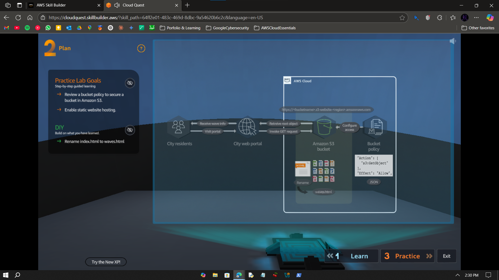
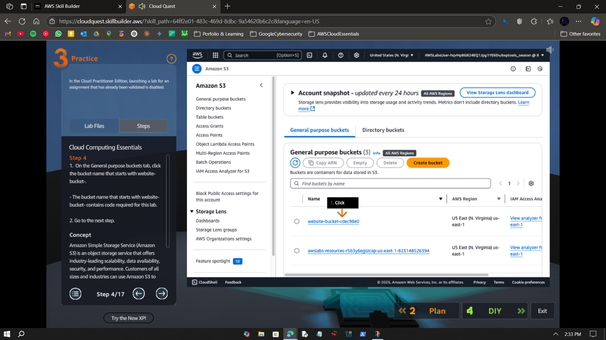
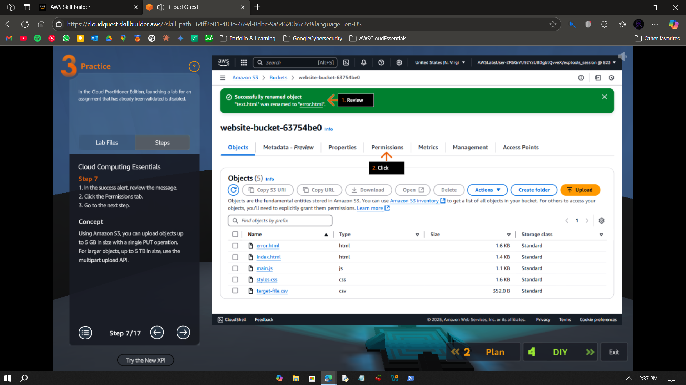
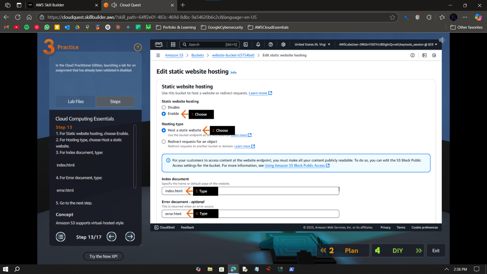
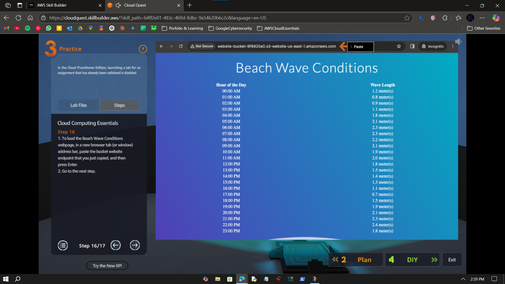
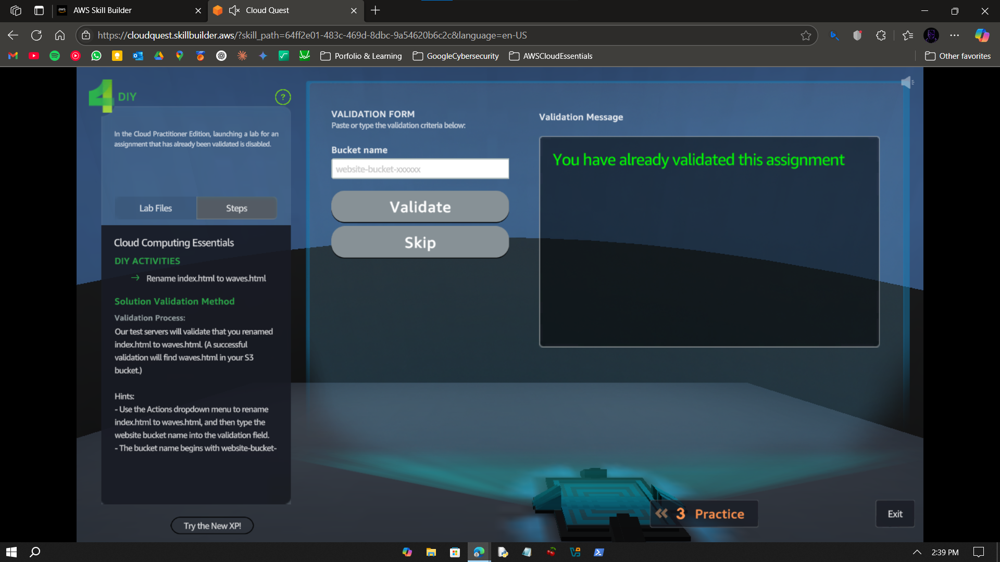

# Visual Guide – A1: Static Web Hosting

> Host a static website using Amazon S3 with public access and default settings.

---

## Step-by-Step Screenshots

### ✅ Step 0

---

### ✅ Step 1

---

### ✅ Step 2

---

### ✅ Step 3

---

### ✅ Step 4

---

### ✅ Step 5

---

## What I Learned

- How to access an S3 bucket  
- How to enable static website hosting  
- How to housekeep files in S3

---

## Notes

- This lab is part of AWS Cloud Quest: Cloud Practitioner  
- Done using AWS Skill Builder sandbox — no billing or CLI used  
- No IAM config or versioning involved in this lab

---

## Contact

**Paarth Pandey**  
[LinkedIn](https://www.linkedin.com/in/paarth-pandey-13779529b/) | [GitHub](https://github.com/paarthpandey10) | paarthdxb@gmail.com

---

## Credits

This lab is based on [AWS Cloud Quest: Cloud Practitioner](https://explore.skillbuilder.aws/learn/course/external/view/elearning/13415/aws-cloud-quest-cloud-practitioner), provided by AWS Skill Builder.  
Visuals, objectives, and task flows belong to Amazon Web Services, Inc. and are used under fair use for personal learning documentation.

—

> Author: [Paarth Pandey](https://github.com/paarthpandey10)
