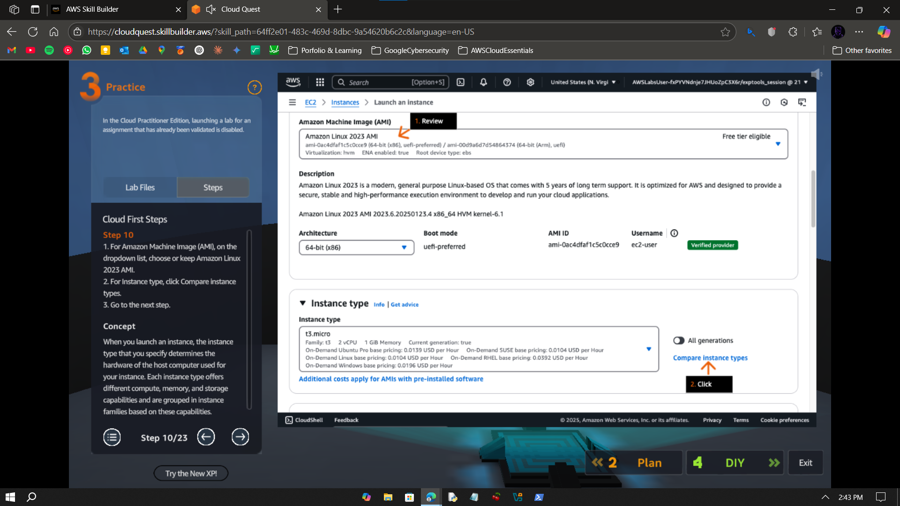
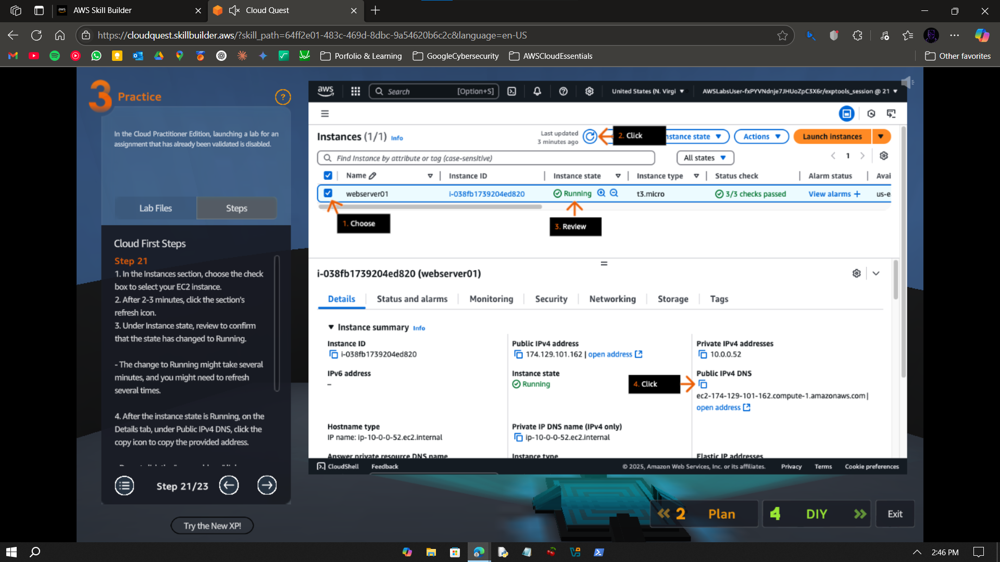

# Visual Guide – A2: Launch EC2 Instance

> Launch and configure EC2 instances with custom user data and verify deployment from a web browser.

---

## Step-by-Step Screenshots

### ✅ Step 0

---

### ✅ Step 1

---

### ✅ Step 2

---

### ✅ Step 3

---

### ✅ Step 4

---

### ✅ Step 5

---

### ✅ Step 6

---

### ✅ Step 7

---

### ✅ Step 8

---

### ✅ Step 9

---

### ✅ Step 10

---

### ✅ Step 11

---

### ✅ Step 12

---

## What I Learned

- How to launch an EC2 instance with specific configurations  
- How to pass user data scripts to initialize an EC2 instance  
- How to validate EC2 deployment using a public IP  
- How to manage and review EC2 instance settings in the AWS Console

---

## Notes

- This lab is part of AWS Cloud Quest: Cloud Practitioner  
- Performed using the AWS Skill Builder sandbox  
- No IAM setup or billing involved — purely educational  
- Focused on EC2 instance config and basic deployment

---

## Contact

**Paarth Pandey**  
[LinkedIn](https://www.linkedin.com/in/paarth-pandey-13779529b/) | [GitHub](https://github.com/paarthpandey10) | paarthdxb@gmail.com

---

## Credits

This lab is based on [AWS Cloud Quest: Cloud Practitioner](https://explore.skillbuilder.aws/learn/course/external/view/elearning/13415/aws-cloud-quest-cloud-practitioner), provided by AWS Skill Builder.  
Visuals, objectives, and task flows belong to Amazon Web Services, Inc. and are used under fair use for personal learning documentation.

—

> Author: [Paarth Pandey](https://github.com/paarthpandey10)
