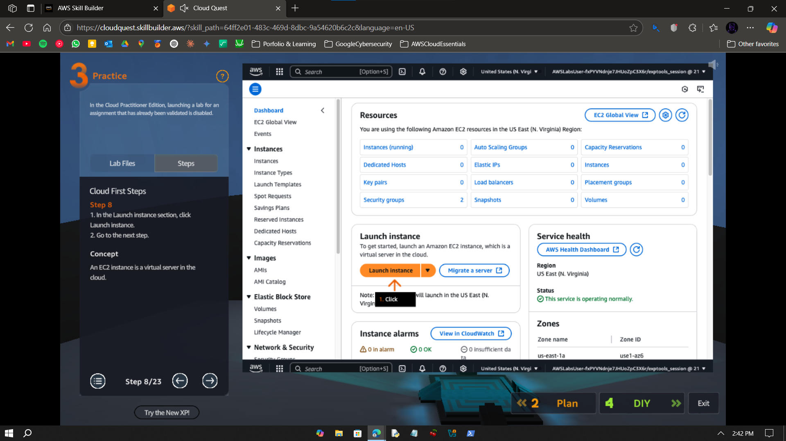
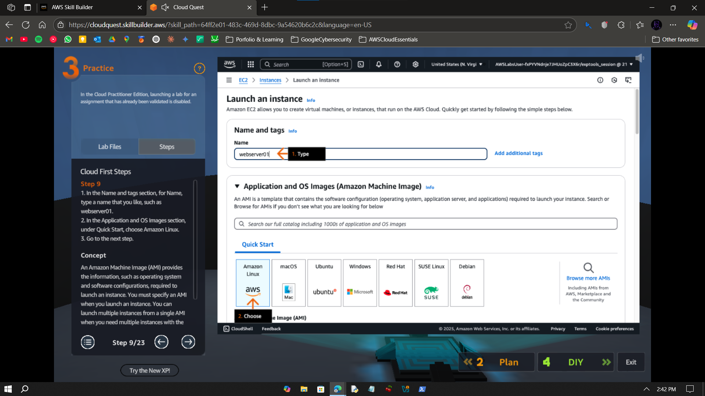
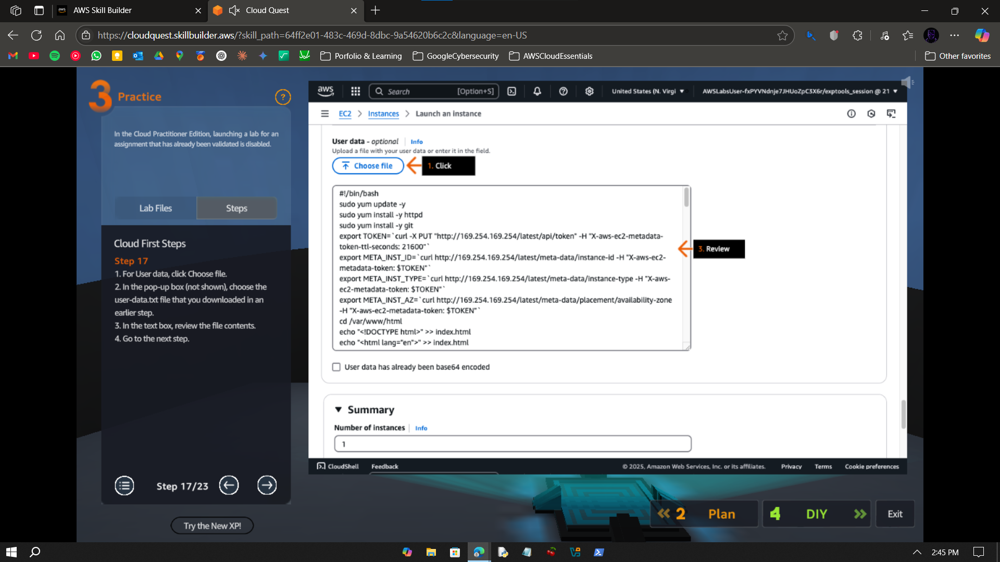
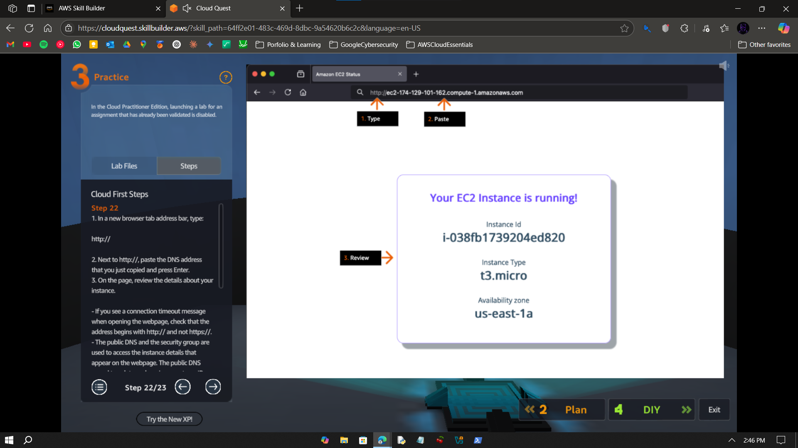

# Walkthrough – A2: Launch EC2 Instance

> Launch and configure EC2 instances with custom user data and verify deployment from a web browser.

---

## Objective

To launch EC2 instances using the AWS Console with a custom user-data script, understand instance types, and verify successful deployment by accessing a hosted webpage.

---

## Disclaimer

The screenshots and lab flow included in this walkthrough are sourced from the official AWS Cloud Quest: Cloud Practitioner platform.  
They are used here strictly for educational purposes, to document and demonstrate hands-on progress in AWS services.

---

## Step-by-Step Instructions

### ✅ Step 0 – Plan Overview

- Here is the plan overview from Cloud Quest.

---

### ✅ Step 1 – Navigate to Amazon S3

- Open the AWS Console and search for S3.
- Go to the S3 dashboard.
- Find object starting with "cloud-first-steps" and click on it.

---

### ✅ Step 2 – Download Lab Data

- Locate user-data.txt
- Download it. 

---

### ✅ Step 3 – Open EC2 Console

- Search and open the EC2 service from the AWS Console.
- Click on 'Launch Instance'. 

---

### ✅ Step 4 – Configure Instance (1/5)

- Give a server name eg: webserver01.
- Select 'Amazon Linux' in AMI.

---

### ✅ Step 5 – Configure Instance (2/5)

- Scroll down with other settings as default. 
- Compare instance types if needed (I did t2.micro vs t3.micro).

---

### ✅ Step 6 – Configure Instance (3/5)

- Proceed to key pair settings
- Select 'Proceed without a key pair (Not recommended)'.
- Scroll to Network Settings and click 'Edit'. 

---

### ✅ Step 7 – Configure Instance (4/5)

- Select the '(cloud-first-steps/LabVpc)'.
- Select the 'us-east-1a' subnet.
- Rename security group to Lab-SG.
- Provide a description.
- Select Type as HTTP.

---

### ✅ Step 8 – Configure Instance (5/5)

- Add the downloaded User Data script under **Advanced > User Data**.

---

### ✅ Step 9 – Launch Instance

- Launch the EC2 instance and wait for initialization to complete.
- Click on 'View All Instances'.
- Copy its 'Public IPv4 DNS'. 

---

### ✅ Step 10 – Verify in EC2 Console

- Head over to a new browser tab.
- Type 'http://' in the address bar and paste the copied DNS address.
- Verify whether instance is running.

---

### ✅ Step 11 – Validate the Lab in Cloud Quest

- Follow the steps to create another instance but this time with subnet in 'us-east-1b'.
- Paste both instance IDs in AWS Cloud Quest validation text box and verify.

---

## What I Learned

- How to launch EC2 instances using the AWS Console  
- Difference between instance types like t2.micro vs t3.micro  
- How to inject a user-data script during launch  
- How to verify instance from browser  

---

## Notes

- This lab is part of AWS Cloud Quest: Cloud Practitioner  
- Done using AWS Skill Builder sandbox — no billing or CLI used  
- No SSH used; browser-based verification only

---

## Contact

For any questions or feedback, reach out:  
**Paarth Pandey**  
[LinkedIn](https://www.linkedin.com/in/paarth-pandey-13779529b/) | [GitHub](https://github.com/paarthpandey10) | paarthdxb@gmail.com

---

## Credits

This lab is based on [AWS Cloud Quest: Cloud Practitioner](https://explore.skillbuilder.aws/learn/course/external/view/elearning/13415/aws-cloud-quest-cloud-practitioner), provided by AWS Skill Builder.  
Visuals, objectives, and task flows belong to Amazon Web Services, Inc. and are used under fair use for personal learning documentation.

—

> Author: [Paarth Pandey](https://github.com/paarthpandey10)  
>  
> AWS Cloud Quest: Cloud Practitioner
