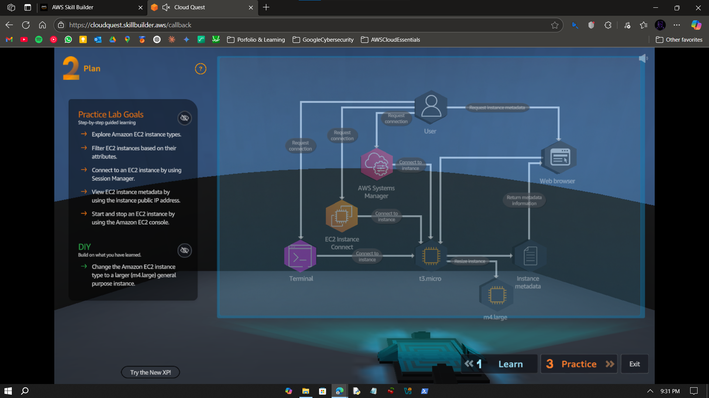
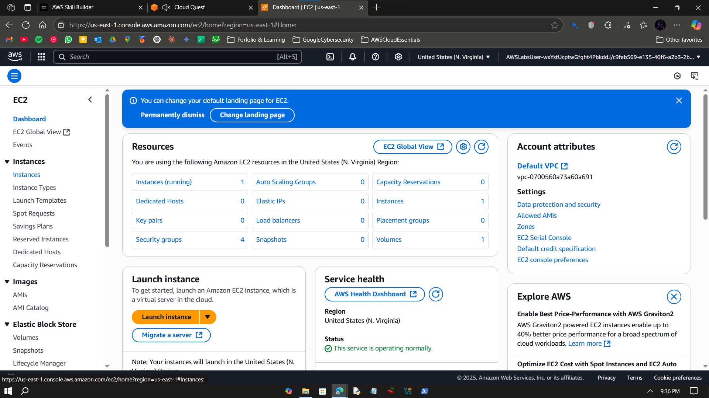
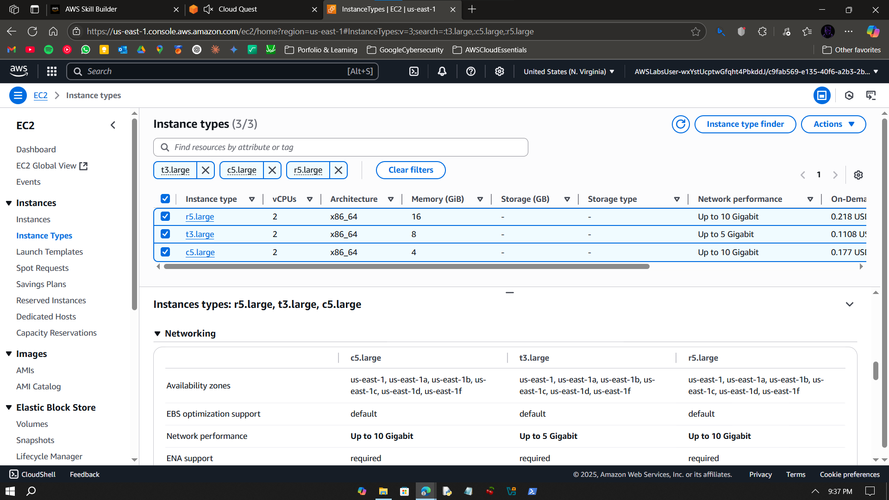
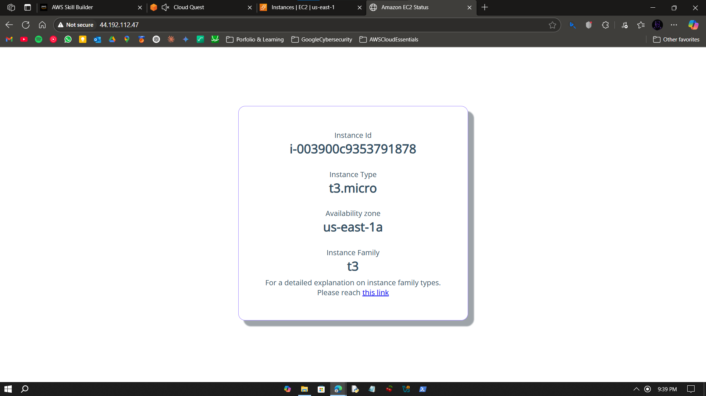
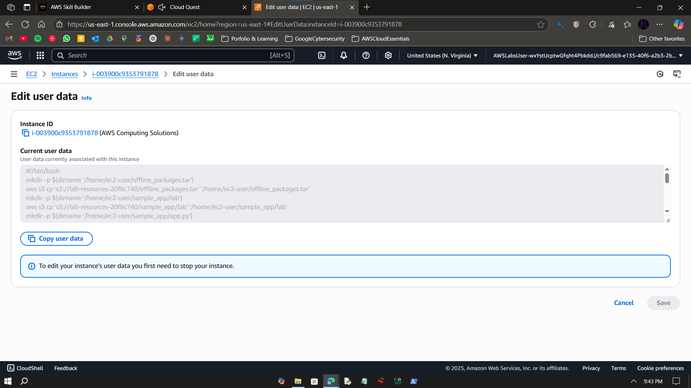
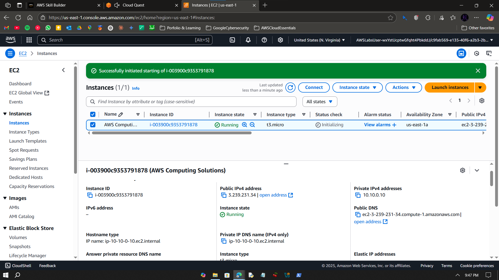
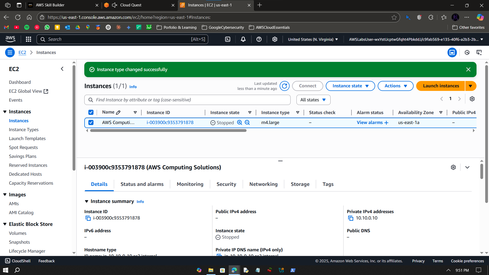

# Visual Guide – A3: Computing Solutions

> Modify and scale an EC2 instance by changing its instance type and verifying new configuration.

---

## Step-by-Step Screenshots

### ✅ Step 0

---

### ✅ Step 1

---

### ✅ Step 2

---

### ✅ Step 3

---

### ✅ Step 4

---

### ✅ Step 5

---

### ✅ Step 6

---

### ✅ Step 7

---

### ✅ Step 8

---

### ✅ Step 9

---

### ✅ Step 10

---

### ✅ Step 11

---

### ✅ Step 12

---

### ✅ Step 13

---

### ✅ Step 14

---

## What I Learned

- EC2 lifecycle operations: stop, start, resize  
- Difference between `t2.micro` and `t3.micro`  
- Role of user-data configuration in EC2  
- SSH via EC2 Connect in-browser  

---

## Notes

- Done in AWS Skill Builder sandbox  
- No CLI or billing used  
- Cloud Quest DIY validation completed

---

## Contact

**Paarth Pandey**  
[LinkedIn](https://www.linkedin.com/in/paarth-pandey-13779529b/) | [GitHub](https://github.com/paarthpandey10) | paarthdxb@gmail.com

---

## Credits

This lab is based on [AWS Cloud Quest: Cloud Practitioner](https://explore.skillbuilder.aws/learn/course/external/view/elearning/13415/aws-cloud-quest-cloud-practitioner), provided by AWS Skill Builder.  
Visuals, objectives, and task flows belong to Amazon Web Services, Inc. and are used under fair use for personal learning documentation.

—

> Author: [Paarth Pandey](https://github.com/paarthpandey10)  
>  
> AWS Cloud Quest: Cloud Practitioner
