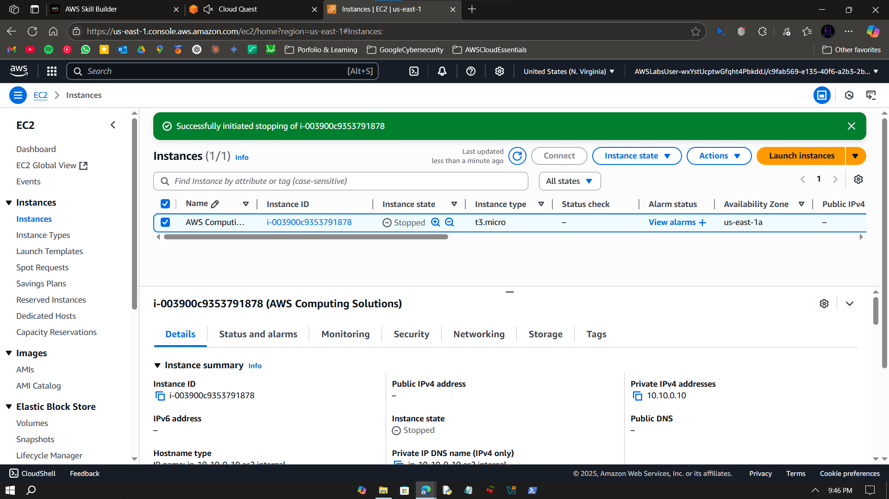

# Walkthrough – A3: Scale EC2 Instance

> Modify and scale an EC2 instance by changing its instance type and verifying new configuration.

---

## Objective

To stop a running EC2 instance, change its type from `t2.micro` to `t3.micro`, update user-data, and verify changes using EC2 Instance Connect and console validation.

---


## Step-by-Step Instructions

### ✅ Step 0 – Plan Overview


---

### ✅ Step 1 – Open AWS Console

- Start lab. 


---

### ✅ Step 2 – Open EC2 Service

- Search for EC2 service using the search bar and click on it. 


---

### ✅ Step 3 – Filter Instance Types

- Navigate over to instance types.
- Filter by typing in the filtering bar for three instance types: t3.large, c5.large, r5.large.
- Review the settings such as networking, storage, pricing etc. 


---

### ✅ Step 4 – Confirm Instance is Running

- Copy the instance's public IPv4 address.
- In a new browser tab, paste the copied IP after typing http:// (so http://x.x.x.x).
- Confirm that the instance is running. 


---

### ✅ Step 5 – Connect via EC2 Instance Connect

- Navigate over to Instance settings > Connect To Instance.
- Review SSH Client settings in SSH Client tab. 


---

### ✅ Step 6 – Check CLI Output

- Navigate over to EC2 Instance Connect tab and connect to the instance's CLI.
- Once in the CLI (opens in a new tab) type the following commands:
```
cd sample_app/
ls
tail -lf aws_compute_solutions.log
```


---

### ✅ Step 7 – Open Edit User-Data

- In Instance settings click on Edit User Data and review user data. 


---

### ✅ Step 8 – Stop Instances

- In Instances, select the instance.
- Click on Actions and Stop Instance.
- Wait for the IPs to disappear and Instance State to show 'Stopped'.



---

### ✅ Step 9 – Start Instance Again

- Start the instance again.
- Wait for the IPs to reappear and Instance State to show 'Running'.


---

### ✅ Step 10 – Stop Again to Change Type

- Now for our DIY, we have to change Instance Type to large size i.e. m4.large - Scale Instance Vertically.
- First we stop our instance by following Step 8.
- Then we navigate to Change Instance Type under Actions > Instance Settings. 


---

### ✅ Step 11 – Change Instance Type

- Now type out the name of new instance type.
- I typed m4.large in this case.
- Compare instance types in this console and change type.


---

### ✅ Step 12 – Confirm Type Changed

- Confirm type changed.
- Now start the instance again. 


---

### ✅ Step 13 – Start New Type Instance

- Confirm that instance is running with its new type. 


---

### ✅ Step 14 – Validate in Cloud Quest

- Validate the DIY activity in AWS Cloud Quest. 


---

## What I Learned

- EC2 lifecycle operations: stop, start, resize  
- Difference between `t2.micro` and `t3.micro`  
- Role of user-data configuration in EC2  
- SSH via EC2 Connect in-browser  

---

## Notes

- Done in AWS Skill Builder sandbox  
- No CLI or billing used  
- Cloud Quest DIY validation completed

---

## Contact

**Paarth Pandey**  
[LinkedIn](https://www.linkedin.com/in/paarth-pandey-13779529b/) | [GitHub](https://github.com/paarthpandey10) | paarthdxb@gmail.com

---

## Credits

This lab is based on [AWS Cloud Quest: Cloud Practitioner](https://explore.skillbuilder.aws/learn/course/external/view/elearning/13415/aws-cloud-quest-cloud-practitioner), provided by AWS Skill Builder.  
Visuals, objectives, and task flows belong to Amazon Web Services, Inc. and are used under fair use for personal learning documentation.

—

> Author: [Paarth Pandey](https://github.com/paarthpandey10)  
>  
> AWS Cloud Quest: Cloud Practitioner
