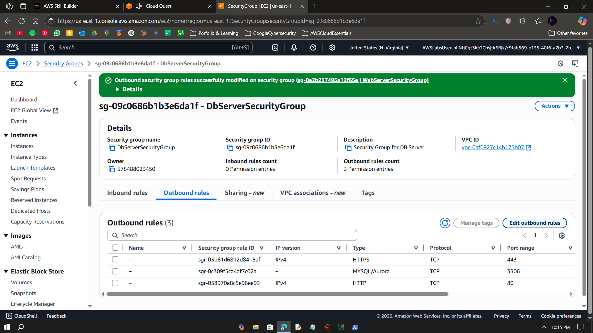

# Walkthrough – A4: Secure Network

> Modify route tables and security groups to fix network issues for an EC2-hosted web server.

---

## Objective

To troubleshoot EC2 network issues by editing subnet route tables and inbound security group rules to allow proper public access and secure DB communication.

---

## Step-by-Step Instructions

### ✅ Step 0 – Plan Overview

---

### ✅ Step 1 – Open EC2 Console

- Start your AWS lab. 
- Search for EC2 service from the search bar and click on it. 

---

### ✅ Step 2 – Copy Web Server Public IP

- Click on Instances and select the web server instance.
- Copy its public IPv4 address. 

---

### ✅ Step 3 – Observe Site Timeout

- Paste the copied address in a new browser tab.
- Confirm that the site is not responding i.e. site timeout error message shown. 

---

### ✅ Step 4 – Check Networking Panel

- Head back to instances and select the web server instance.
- Navigate over to Networking tab and click on the shown subnet ID.

---

### ✅ Step 5 – Open Subnet Console

- In the opened subnet console, select the shown network subnet.
- Head to the Route Table tab and locate the route table address.
- Click on the shown route table address. 

---

### ✅ Step 6 – Open Route Table

- In the route table console, head over to the Routes tab.
- Click on Edit Routes button. 

---

### ✅ Step 7 – Edit Routes

- In the new console, click on Add route.
- Select Destination as 0.0.0.0/0. 
- Select Target as Internet Gateway

---

### ✅ Step 8 – Updated Route Saved

- Click on Save Changes.
- Confirm that the settings have updated. 

---

### ✅ Step 9 – Open Security Group Console

- Open Web Server Security Group console and click on Edit inbound rules. 

---

### ✅ Step 10 – Edit Rules

- Modify rules to match the configurations as shown in the screensho. 

---

### ✅ Step 11 – Updated SG Rules

- Confirm that the inbound rules have taken place.
- Now head over to the Outbound rules tab for the web server security group.
- Click on Edit outbound rules. 

---

### ✅ Step 12 – Add All Traffic Rule

- In the console click on Add rule.
- Match the configurations of the new rule with the ones shown in screenshot. 

---

### ✅ Step 13 – Copy Updated Public IP

- Click on Save Changes. 
- Head back to Web Server instance to copy its IPv4 address. 

---

### ✅ Step 14 – Test Website Access

- Paste the copied address in a new browser tab.
- Confirm that the address is working now. 

---

### ✅ Step 15 – Open DB SG Console

- Open the DB Server SG console.

---

### ✅ Step 16 – Edit DB SG Rules

- Click on Inbound rules tab and click Edit inbound rules.
- Click on Add rule.
- Match the new rule's configurations with the ones shown in screenshot.
- Save changes. 

---

### ✅ Step 17 – Validate in Cloud Quest

- Paste the name of the DB Server Security Group in AWS Cloud Quest console.
- Validate DIY.

---

## What I Learned

- Route table modification for subnets  
- Security group rule logic and access controls  
- Fixing timeouts using networking tools  
- Public/private IP-based access verification  

---

## Notes

- All steps completed in AWS sandbox environment  
- Verified solution using web browser only  
- No CLI or paid resources used

---

## Contact

**Paarth Pandey**  
[LinkedIn](https://www.linkedin.com/in/paarth-pandey-13779529b/) | [GitHub](https://github.com/paarthpandey10) | paarthdxb@gmail.com

---

## Credits

This lab is based on [AWS Cloud Quest: Cloud Practitioner](https://explore.skillbuilder.aws/learn/course/external/view/elearning/13415/aws-cloud-quest-cloud-practitioner), provided by AWS Skill Builder.  
Visuals, objectives, and task flows belong to Amazon Web Services, Inc. and are used under fair use for personal learning documentation.

—

> Author: [Paarth Pandey](https://github.com/paarthpandey10)  
>  
> AWS Cloud Quest: Cloud Practitioner
