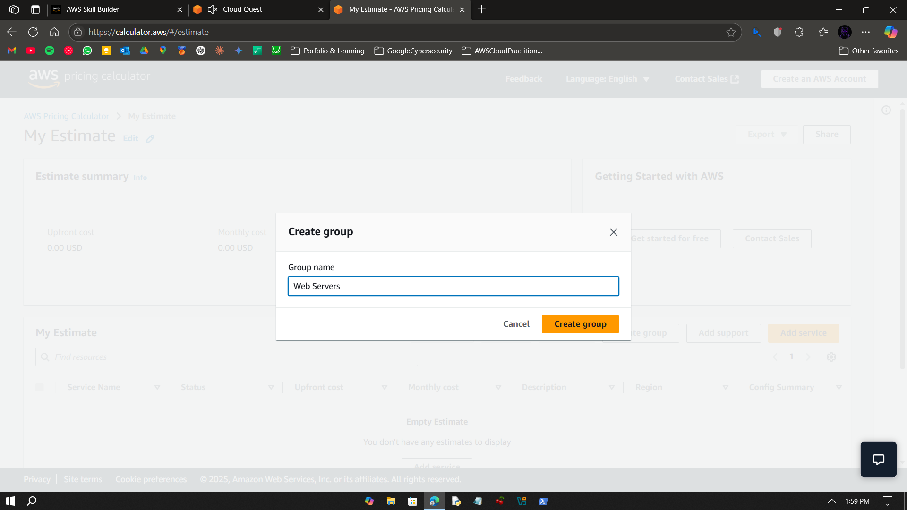
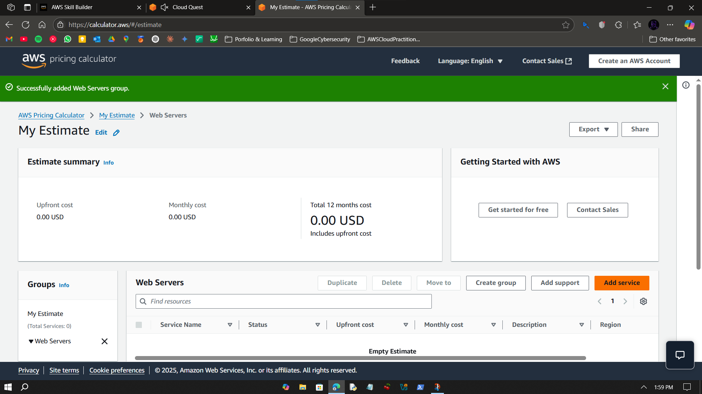
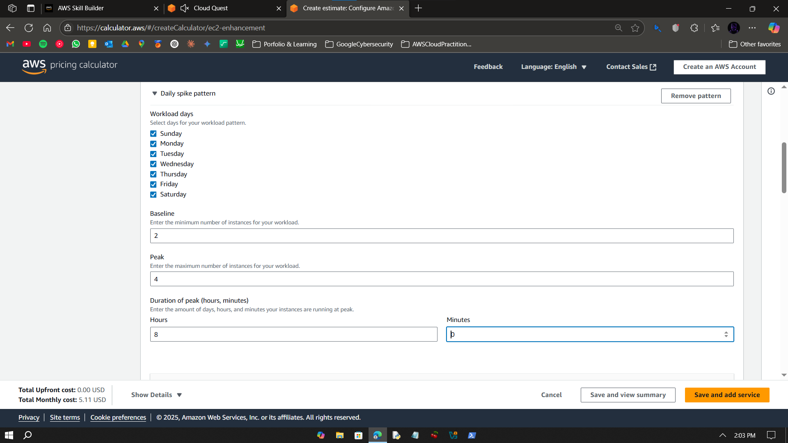
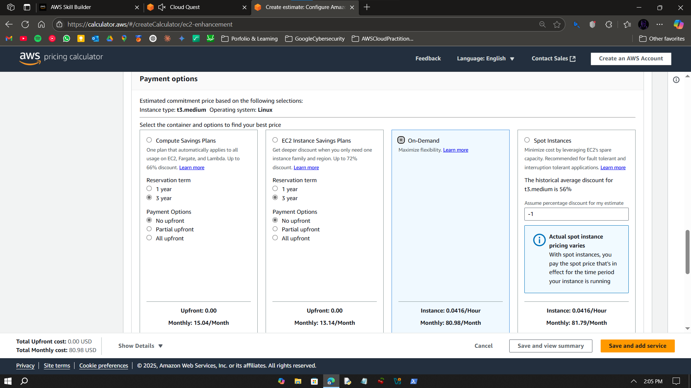
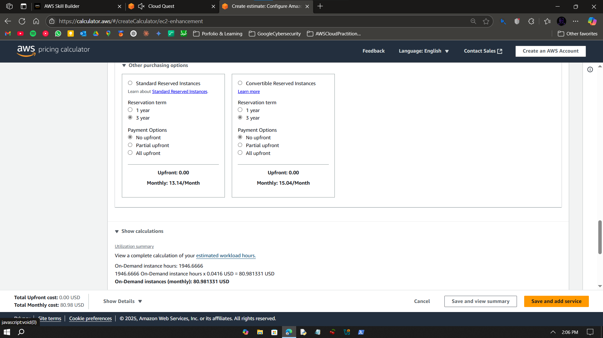

# Visual Guide – A5: EC2 Pricing Calculator

> Step-by-step screenshots for estimating EC2 instance costs using AWS Pricing Calculator.

---

## Step-by-Step Screenshots

### ✅ Step 0

---

### ✅ Step 1

---

### ✅ Step 2

---

### ✅ Step 3

---

### ✅ Step 4

---

### ✅ Step 5

---

### ✅ Step 6

---

### ✅ Step 7

---

### ✅ Step 8

---

### ✅ Step 9

---

### ✅ Step 10

---

### ✅ Step 11

---

### ✅ Step 12

---

### ✅ Step 13

---

### ✅ Step 14

---

### ✅ Step 15

---

### ✅ Step 16

---

### ✅ Step 17

---

### ✅ Step 18

---

### ✅ Step 19

---

### ✅ Step 20

---

### ✅ Step 21

---

## What I Learned

- Navigating AWS Pricing Calculator  
- Configuring EC2 instances and workloads  
- Estimating monthly costs with storage and data transfer  
- Sharing and updating estimates  

---

## Notes

- Lab completed in AWS Skill Builder sandbox  
- No billing incurred  

---

## Contact

**Paarth Pandey**  
[LinkedIn](https://www.linkedin.com/in/paarth-pandey-13779529b/) | [GitHub](https://github.com/paarthpandey10) | paarthdxb@gmail.com

---

## Credits

Based on AWS Cloud Quest: Cloud Practitioner by AWS Skill Builder.  
Visuals and content belong to AWS, used here under fair use for educational documentation.

—

> Author: [Paarth Pandey](https://github.com/paarthpandey10)  
> AWS Cloud Quest: Cloud Practitioner
