# Visual Guide – A8: First NoSQL Database

> Step-by-step screenshots for creating a DynamoDB table and querying data.

---

## Step-by-Step Screenshots

### ✅ Step 0

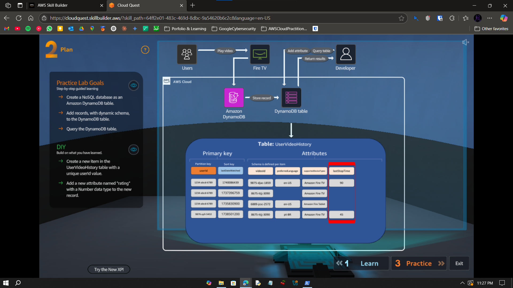

---

### ✅ Step 1

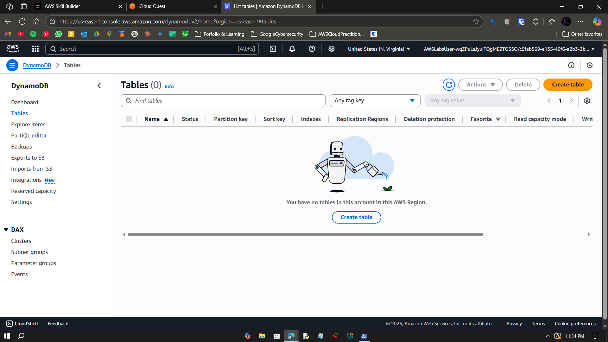

---

### ✅ Step 2

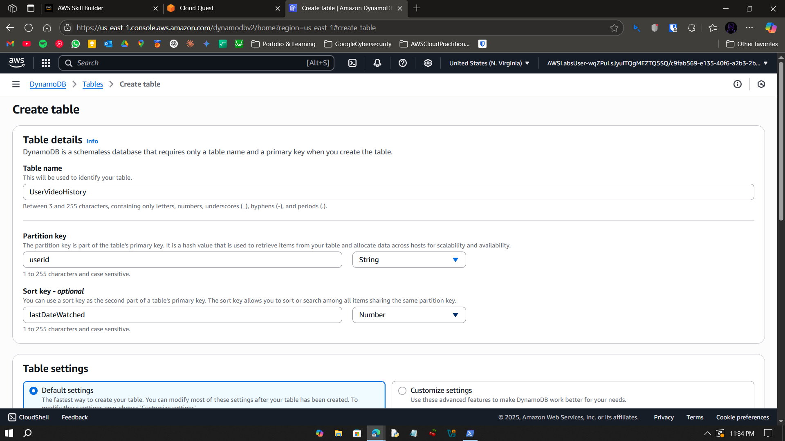

---

### ✅ Step 3

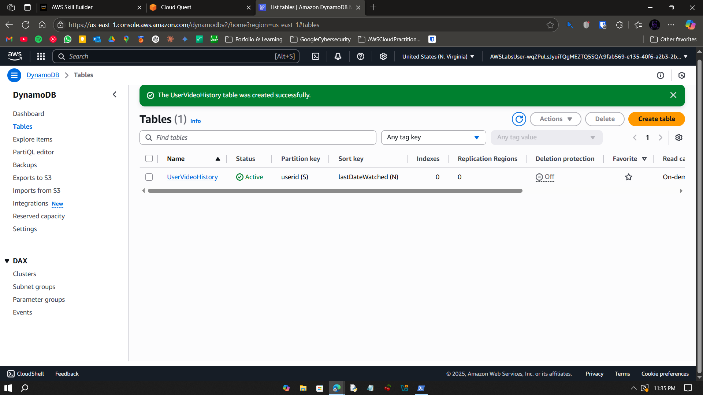

---

### ✅ Step 4

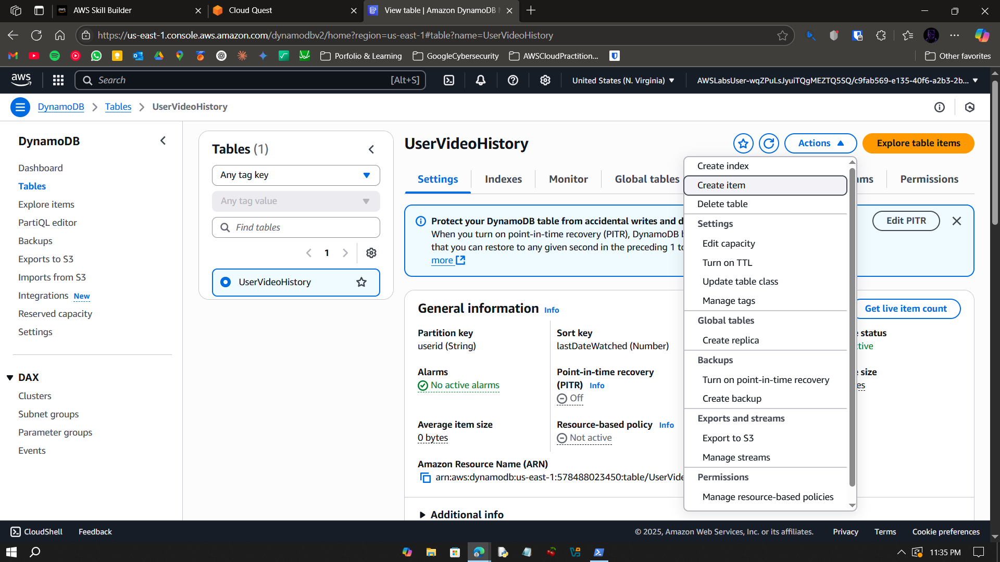

---

### ✅ Step 5

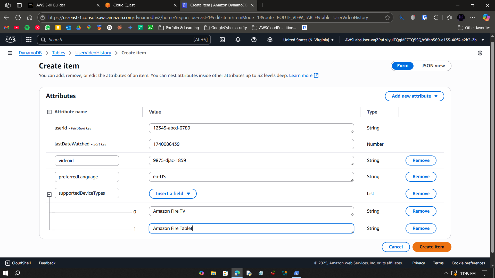

---

### ✅ Step 6

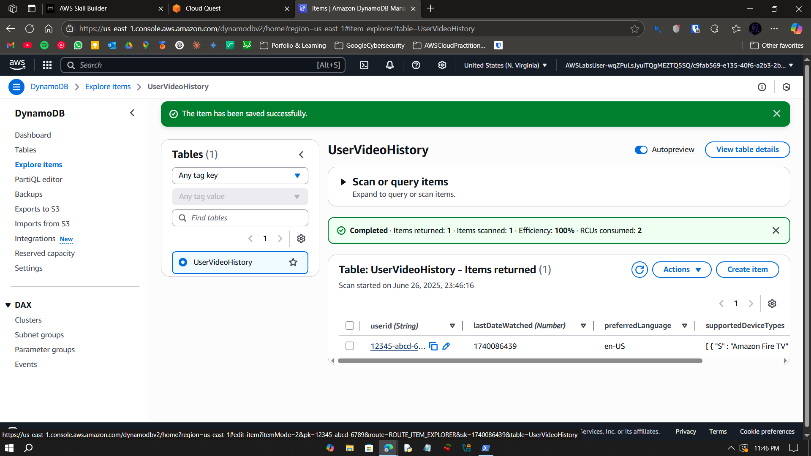

---

### ✅ Step 7

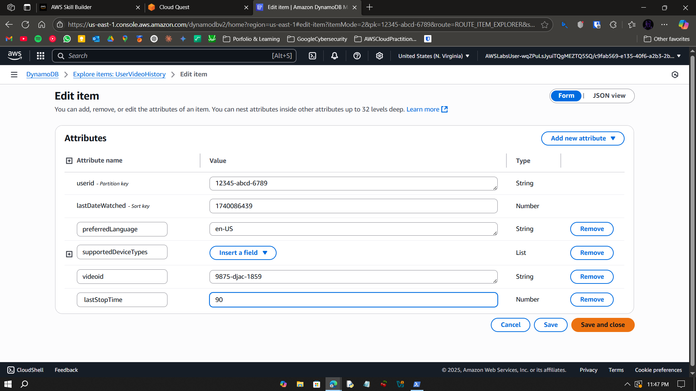

---

### ✅ Step 8

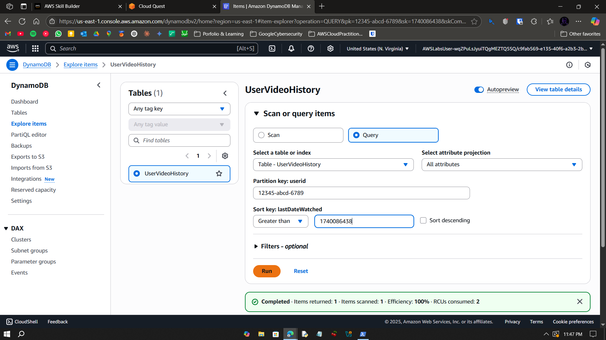

---

### ✅ Step 9

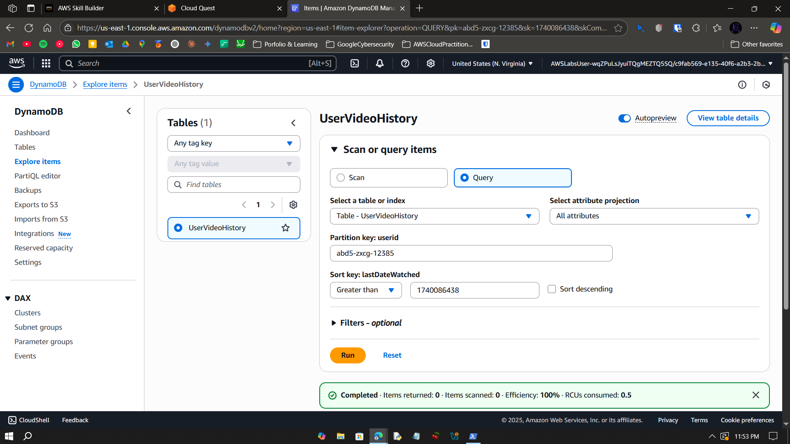

---

### ✅ Step 10

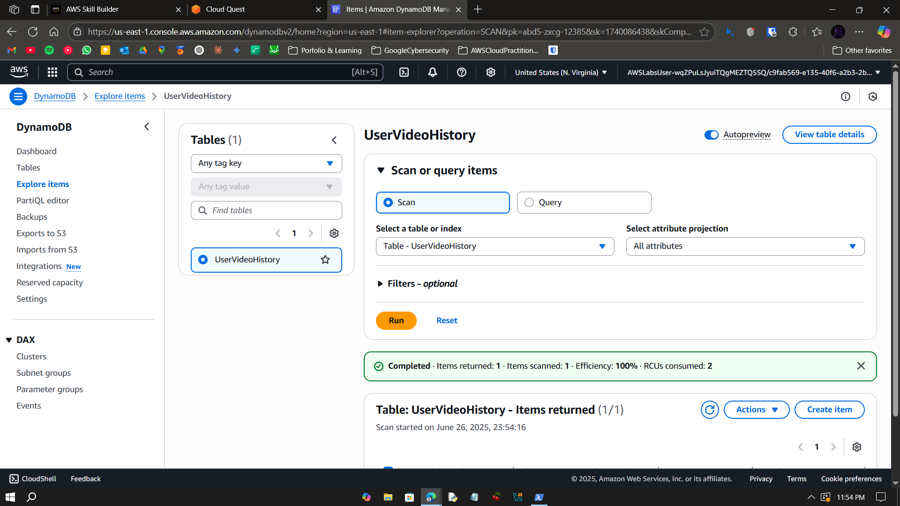

---

### ✅ Step 11

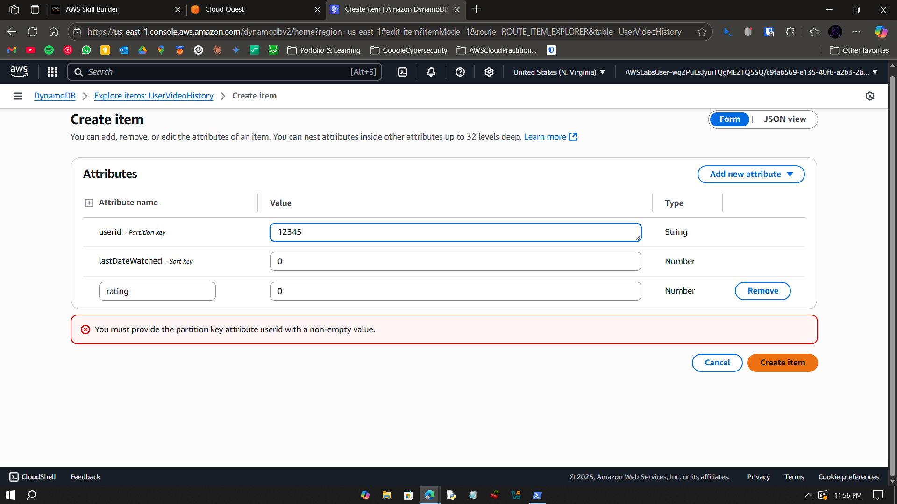

---

### ✅ Step 12

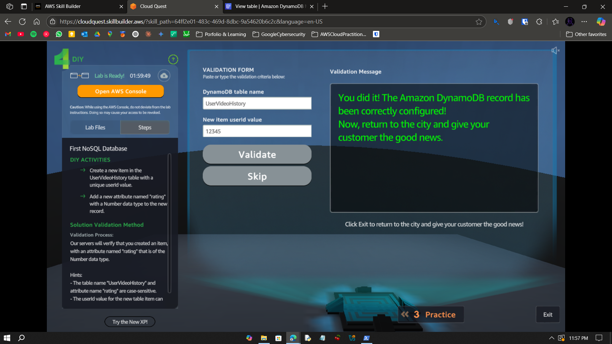

---

## What I Learned

- Created a DynamoDB table with primary key schema  
- Inserted and queried customer metadata  
- Practiced using AWS NoSQL options  

---

## Notes

- All steps performed via AWS console  
- Serverless and elastic data store  
- Great for high-speed applications  

---

## Contact

**Paarth Pandey**  
[LinkedIn](https://www.linkedin.com/in/paarth-pandey-13779529b/)  
[GitHub](https://github.com/paarthpandey10)  
paarthdxb@gmail.com

---

## Credits

This lab is part of [AWS Cloud Quest: Cloud Practitioner](https://explore.skillbuilder.aws/learn/course/external/view/elearning/13415/aws-cloud-quest-cloud-practitioner)  
Visuals used under fair educational use.

—
> Author: Paarth Pandey
