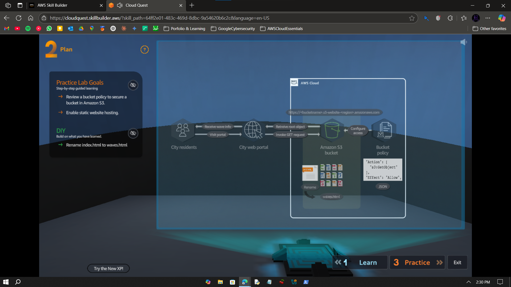
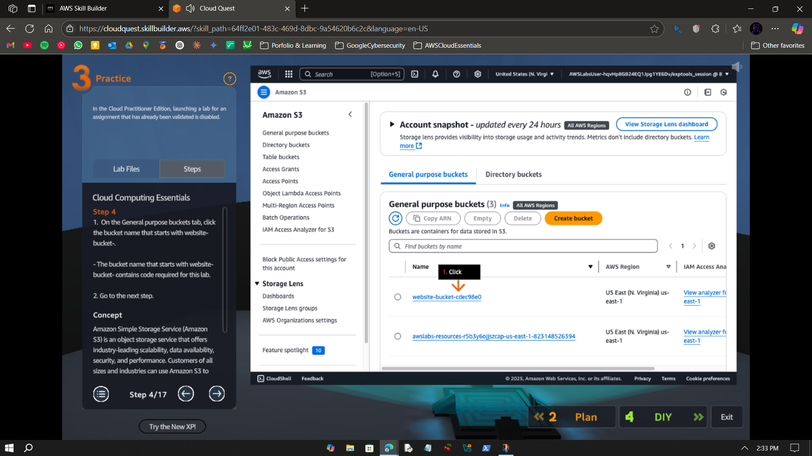
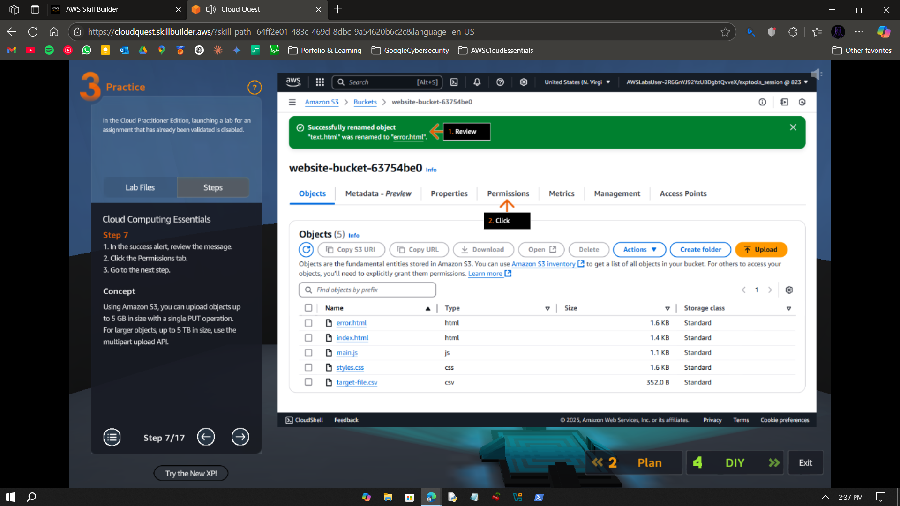
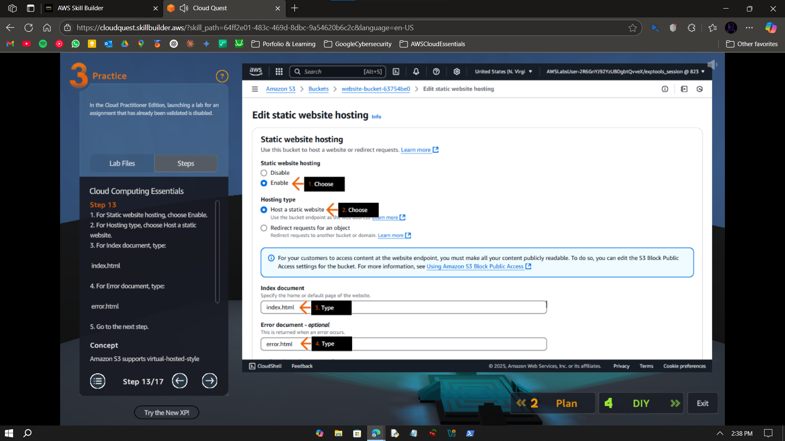
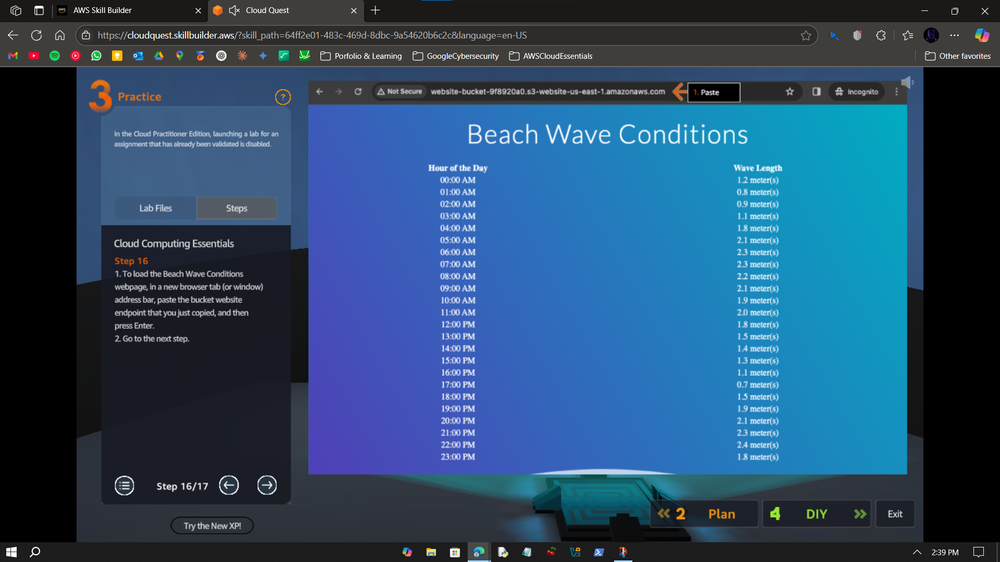
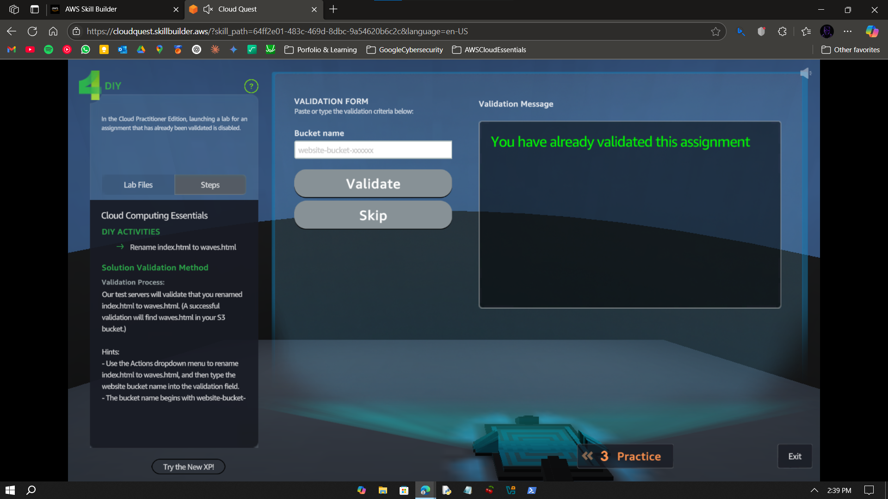

# Walkthrough – A1: Static Web Hosting

> Host a static website using Amazon S3 with public access and default settings.

---

## Objective

To host a basic static website using Amazon S3 by enabling static hosting, renaming HTML files, and accessing the site via the generated endpoint.

---

## Important

The screenshots provided in this walkthrough are taken from AWS's official guide in Cloud Quest. 
This is due to the fact that I already completed the lab before the creation of this repo and did not take screenshots for this walkthrough at that time. 
AWS Cloud Practitioner edition does not allow recreation of practice lab a second time. 

---

## Step-by-Step Instructions

### ✅ Step 0 – Plan Overview

- Here is the plan over view. 

### ✅ Step 1 – Open Amazon S3 from AWS Console

- Search S3 in the search bar and click on it. 

---

### ✅ Step 2 – Choose website-bucket and Rename

- Find the object with a name starting with "website-bucket" and click on it. 
- Find the file named "text.html" and rename it to "error.html".

---

### ✅ Step 3 – Enable Static Website Hosting for website-bucket

- Navigate over to "Edit static website hosting" in website-bucket's properties.
- Set static website hosting to "Enable".
- Set hosting type to "Host a static website".
- Specify index document as "index.html".
- Specify error document as "error.html".
- Save changed.

---

### ✅ Step 4 – Test Website

- Copy the bucket website endpoint.
- Go to a new browser tab.
- Paste the copied link.
- Your site is live.

---

### ✅ Step 5 – Rename index.html

- Go back to s3 console and click on website-bucket.
- Rename index.html to waves.html.
- Copy website-bucket name and paste in Cloud Quest validation text box.

---

## What I Learned

- How to access an S3 bucket  
- How to enable static website hosting  
- How to housekeep files in S3

---

## Notes

- This lab is part of AWS Cloud Quest: Cloud Practitioner  
- Done using AWS Skill Builder sandbox — no billing or CLI used  
- No IAM config or versioning involved in this lab

---

## Contact

For any questions or feedback, reach out:  
**Paarth Pandey**  
[LinkedIn](https://www.linkedin.com/in/paarth-pandey-13779529b/) | [GitHub](https://github.com/paarthpandey10) | paarthdxb@gmail.com

—

> Author: [Paarth Pandey](https://github.com/paarthpandey10)  
>  
> AWS Cloud Quest: Cloud Practitioner
