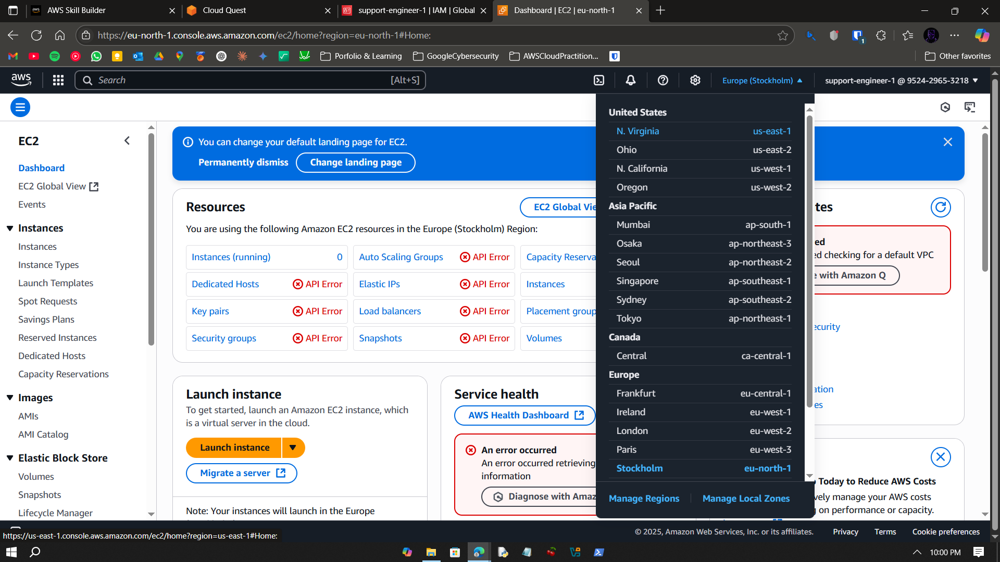

# Visual Guide – A10: Core Security Concepts

> Step-by-step screenshots for creating IAM policies and enforcing access control.

---

## Step-by-Step Screenshots

### ✅ Step 0  
  
---  
### ✅ Step 1  
  
---  
### ✅ Step 2  
  
---  
### ✅ Step 3  
  
---  
### ✅ Step 4  
  
---  
### ✅ Step 5  
  
---  
### ✅ Step 6  
  
---  
### ✅ Step 7  
  
---  
### ✅ Step 8  
  
---  
### ✅ Step 9  
  
---  
### ✅ Step 10  
  
---  
### ✅ Step 11  
  
---  
### ✅ Step 12  
  
---  
### ✅ Step 13  
  
---  
### ✅ Step 14  
  
---  
### ✅ Step 15  
  
---  
### ✅ Step 16  
  
---  
### ✅ Step 17  
  
---  
### ✅ Step 18  
  
---  
### ✅ Step 19  
  
---  
### ✅ Step 20  
  
---  
### ✅ Step 21  
  
---  
### ✅ Step 22  
  
---

## What I Learned

- IAM concepts: users, groups, policies  
- Principle of least privilege in action  
- IAM policy simulator and access control  
- Real-world role-based permission design

---

## Notes

- IAM policies use JSON syntax  
- Avoid granting full admin access by default  
- Always test permissions before deployment  

---

## Contact

**Paarth Pandey**  
[LinkedIn](https://www.linkedin.com/in/paarth-pandey-13779529b/)  
[GitHub](https://github.com/paarthpandey10)  
paarthdxb@gmail.com

---

## Credits

This lab is part of [AWS Cloud Quest: Cloud Practitioner](https://explore.skillbuilder.aws)  
Visuals used under fair educational use.

—
> Author: Paarth Pandey
>
> AWS Cloud Quest: Cloud Practitioner
