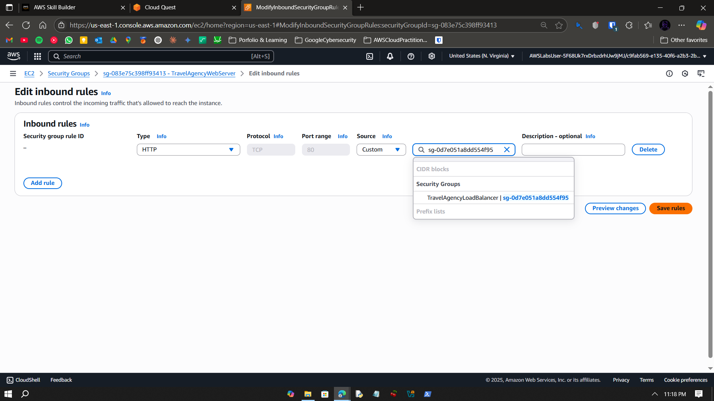
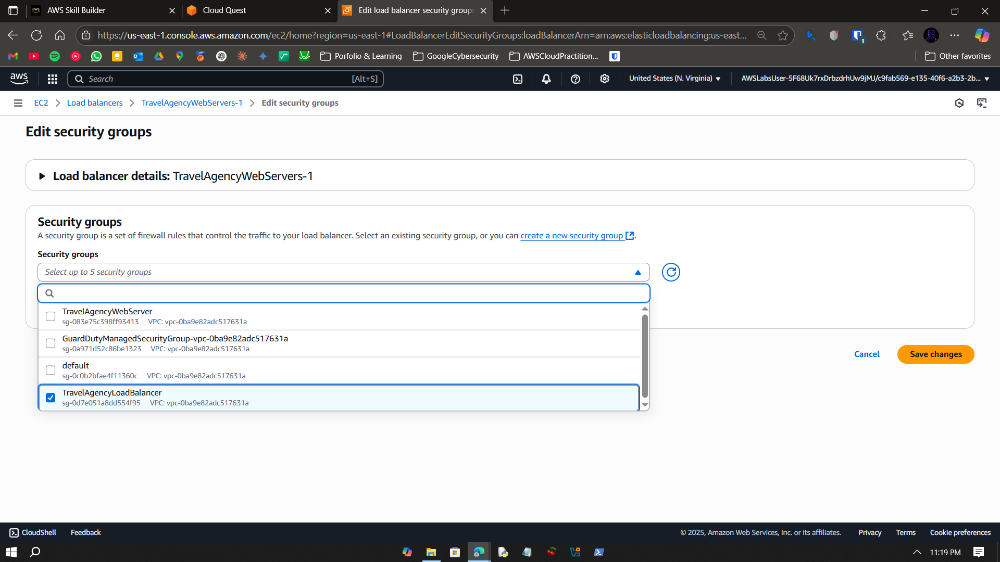
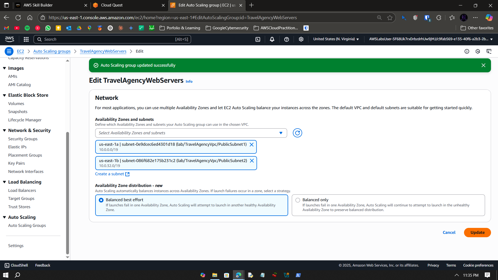
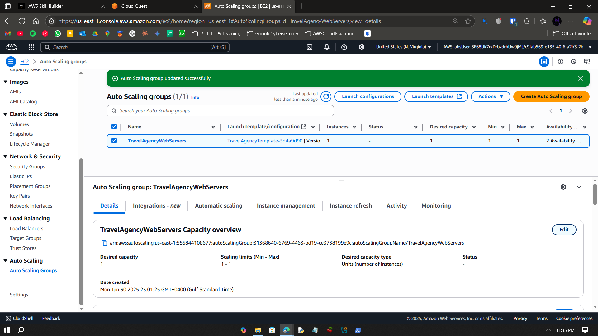
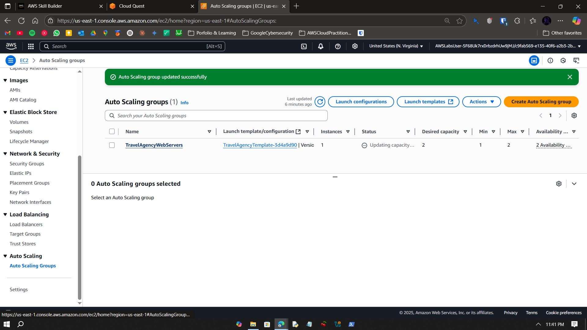
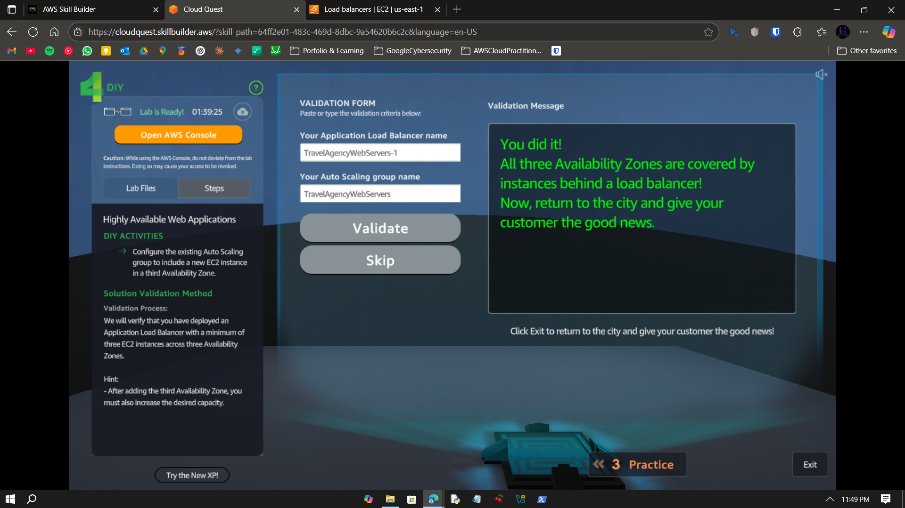

# Visual Guide – A12: Highly Available Web Applications

> Step-by-step screenshots for deploying a multi-AZ, fault-tolerant web app.

---

## Step-by-Step Screenshots

### ✅ Step 0  
  
---  
### ✅ Step 1  
  
---  
### ✅ Step 2  
  
---  
### ✅ Step 3  
  
---  
### ✅ Step 4  
  
---  
### ✅ Step 5  
  
---  
### ✅ Step 6  
  
---  
### ✅ Step 7  
  
---  
### ✅ Step 8  
  
---  
### ✅ Step 9  
  
---  
### ✅ Step 10  
  
---  
### ✅ Step 11  
  
---  
### ✅ Step 12  
  
---  
### ✅ Step 13  
  
---  
### ✅ Step 14  
  
---  
### ✅ Step 15  
  
---  
### ✅ Step 16  
  
---  
### ✅ Step 17  
  
---  
### ✅ Step 18  
  
---  
### ✅ Step 19  
  
---  
### ✅ Step 20  
  
---  
### ✅ Step 21  
  
---  
### ✅ Step 22  
  
---  
### ✅ Step 23  
  
---  
### ✅ Step 24  
  
---  
### ✅ Step 25  
  
---  
### ✅ Step 26  
  
---  
### ✅ Step 27  
  
---  
### ✅ Step 28  
  
---  
### ✅ Step 29  
  
---  
### ✅ Step 30  
  
---  
### ✅ Step 31  
  
---  
### ✅ Step 32  
  
---  
### ✅ Step 33  
  
---  
### ✅ Step 34  
  
---  
### ✅ Step 35  
  
---  
### ✅ Step 36  
  
---  
### ✅ Step 37  
  
---  
### ✅ Step 38  
  
---  
### ✅ Step 39  
  
---  
### ✅ Step 40  
  
---  
### ✅ Step 41  
  
---  
### ✅ Step 42  
  
---  
### ✅ Step 43  
  
---  
### ✅ Step 44  
  
---  
### ✅ Step 45  
  
---  
### ✅ Step 46  
  
---  
### ✅ Step 47  
  
---

## What I Learned

- Multi-AZ web architecture using ALB + ASG  
- Health check routing and fault tolerance  
- Consistent availability through scaling  
- Elastic load balancing across zones  

---

## Notes

- Web app must be stateless for seamless scaling  
- Public subnets and routing key to accessibility  
- Health checks drive both scaling + healing  

---

## Contact

**Paarth Pandey**  
[LinkedIn](https://www.linkedin.com/in/paarth-pandey-13779529b/)  
[GitHub](https://github.com/paarthpandey10)  
paarthdxb@gmail.com  

---

## Credits

This lab is part of [AWS Cloud Quest: Cloud Practitioner](https://explore.skillbuilder.aws)  
Visuals used under fair educational use.

—  
> Author: Paarth Pandey
> 
> AWS Cloud Quest: Cloud Practitioner
